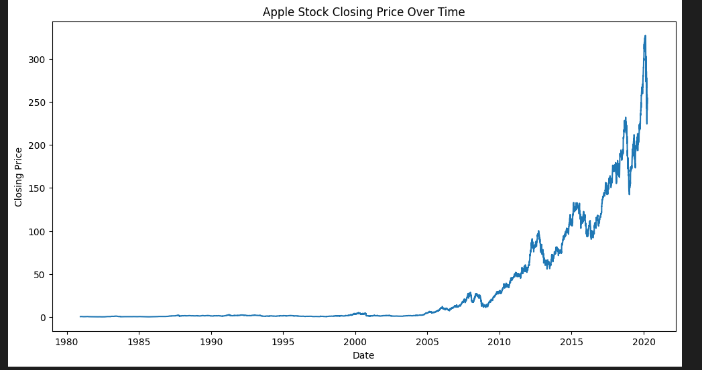
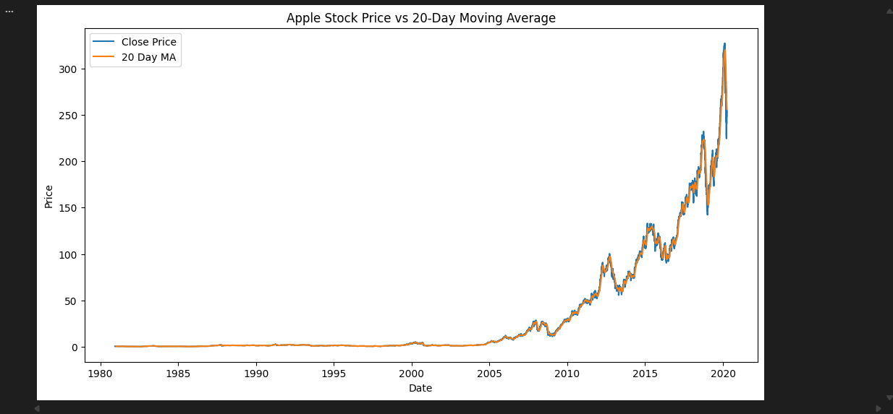
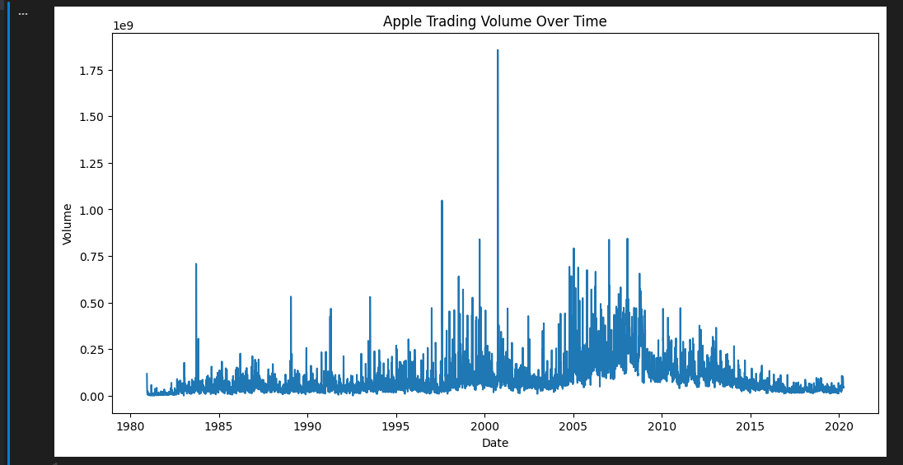

# 🍎 Apple Stock Market EDA

## 📖 Project Overview

This project performs Exploratory Data Analysis (EDA) on Apple's historical stock market data using Python, Pandas, NumPy, and Matplotlib.

The goal of this analysis is to understand Apple's long-term stock performance, identify market trends, analyze trading volume patterns, calculate daily returns, and visualize price movements using financial analytics techniques.

---

## 🎯 Objectives

- Explore and understand Apple's historical stock dataset
- Perform statistical analysis on stock prices
- Analyze daily stock returns
- Calculate and visualize moving averages
- Study trading volume behavior over time
- Generate insights from historical market performance

---

## 🛠️ Technologies Used

- Python
- Pandas
- NumPy
- Matplotlib
- Jupyter Notebook
- Git
- GitHub

---

## 📂 Dataset Information

The dataset contains historical Apple (AAPL) stock market data including:

- Date
- Open Price
- High Price
- Low Price
- Close Price
- Adjusted Close Price
- Trading Volume

### Dataset Period

**1980 - 2020**

---

## 📊 Exploratory Data Analysis Performed

### Data Exploration

- Dataset Preview
- Dataset Shape Analysis
- Column Inspection
- Data Type Verification

### Data Quality Checks

- Missing Value Analysis
- Statistical Summary

### Financial Analysis

- Daily Return Calculation
- Moving Average Analysis
- Trading Volume Analysis
- Price Trend Analysis

---

# 📈 Visualizations

## Apple Closing Price Over Time

This visualization highlights Apple's long-term stock growth and major market movements across four decades.



---

## Apple Stock Price vs 20-Day Moving Average

The 20-Day Moving Average smooths short-term fluctuations and helps identify broader market trends.



---

## Apple Trading Volume Over Time

Trading volume analysis reveals periods of high investor activity and market interest.



---

# 🔍 Key Findings

1. The dataset contains historical Apple stock data spanning several decades.

2. Apple demonstrated significant long-term growth in stock price.

3. Daily returns indicate periods of both growth and volatility.

4. Trading volume varied significantly across different market periods.

5. The 20-day moving average effectively smoothed short-term fluctuations and revealed broader trends.

6. Apple's highest closing price reflects strong long-term shareholder value creation.

7. Historical data suggests Apple has been one of the strongest long-term performers in the equity market.

---

## 🚀 How to Run This Project

### Clone Repository

```bash
git clone https://github.com/Rvx0098/apple-stock-eda.git
```

### Navigate to Project Folder

```bash
cd apple-stock-eda
```

### Create Virtual Environment

```bash
python -m venv .venv
```

### Activate Environment

#### Windows

```bash
.venv\Scripts\activate
```

#### Linux / Mac

```bash
source .venv/bin/activate
```

### Install Dependencies

```bash
pip install pandas numpy matplotlib openpyxl jupyter
```

### Launch Notebook

```bash
jupyter notebook
```

Open:

```text
Apple_Stock_EDA.ipynb
```

---

## 📁 Project Structure

```text
apple-stock-eda/
│
├── Apple_Stock_EDA.ipynb
├── AAPL_Stock_Data.xlsx
├── README.md
├── .gitignore
│
└── images/
    ├── apple_closing_price.png
    ├── moving_average.png
    └── trading_volume.png
```

---

## 📌 Skills Demonstrated

- Data Cleaning
- Exploratory Data Analysis
- Financial Data Analysis
- Data Visualization
- Statistical Analysis
- Python Programming
- Pandas
- NumPy
- Matplotlib
- Git & GitHub

---

## 👨‍💻 Author

### Rishit Verma

Aspiring Data Analyst passionate about transforming raw data into actionable insights through analytics, visualization, and storytelling.

- GitHub: https://github.com/Rvx0098
- LinkedIn: https://linkedin.com/rishitvermaa

---
⭐ If you found this project useful, consider giving it a star.